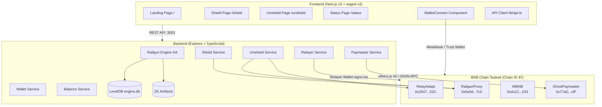
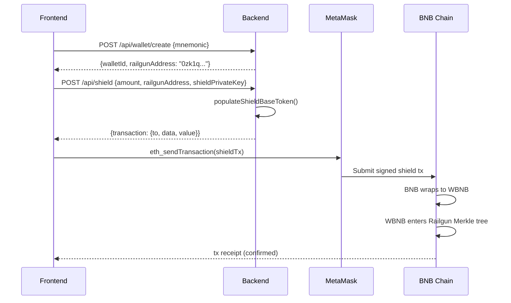
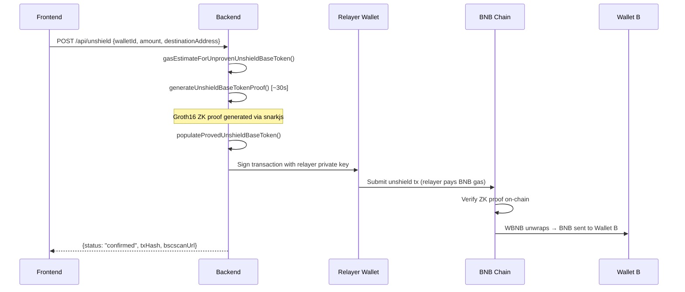

# GhostFund — Privacy Gas Relayer for BNB Chain

**Break the on-chain link between your wallets.**

GhostFund lets users send BNB from Wallet A to Wallet B with **zero on-chain connection**. It uses [Railgun](https://railgun.org)'s UTXO-based zero-knowledge privacy system — the first gas relayer implementation on BNB Chain — so no observer, analytics firm, or adversary can trace the transfer.

> Built for the BNB Chain Hackathon. All contracts are **deployed and live** on BSC Testnet.

---

## How It Works

```
1. User shields BNB from Wallet A  →  tokens enter Railgun's encrypted Merkle tree
2. User specifies Wallet B          →  a fresh wallet with zero BNB is fine
3. GhostFund relayer generates ZK proof, signs + submits the unshield tx, pays gas
4. Wallet B receives BNB            →  no link to Wallet A on-chain
```

**What the blockchain sees:**

```
TX 1:  0xSource       →  RailgunProxy     (shield — one of many deposits)
TX 2:  GhostRelayer   →  RailgunProxy     (unshield to 0xDest — relayer pays gas)

No transaction between 0xSource and 0xDest. The link is broken.
```

---

## User Journey

```mermaid
flowchart TD
    START([User visits GhostFund]) --> CONNECT[Connect MetaMask on BSC Testnet]
    CONNECT --> SHIELD_PAGE[Navigate to /shield]

    subgraph SHIELD["Phase 1: Shield BNB (User Signs)"]
        SHIELD_PAGE --> INIT_WALLET[Initialize 0zk Wallet<br/>POST /api/wallet/create]
        INIT_WALLET --> SIGN_KEY[Sign message in MetaMask<br/>to derive shield private key]
        SIGN_KEY --> ENTER_AMT[Enter BNB amount]
        ENTER_AMT --> POP_TX[Backend populates shield tx<br/>POST /api/shield]
        POP_TX --> MM_SIGN[MetaMask signs on-chain tx]
        MM_SIGN --> BSC_CONFIRM[BSC confirms shield tx<br/>BNB → WBNB → Railgun Merkle tree]
    end

    BSC_CONFIRM --> STATUS_PAGE[Check /status page<br/>View private balance]
    STATUS_PAGE --> UNSHIELD_PAGE[Navigate to /unshield]

    subgraph UNSHIELD["Phase 2: Unshield BNB (Relayer Signs)"]
        UNSHIELD_PAGE --> ENTER_DEST[Enter destination Wallet B address]
        ENTER_DEST --> ENTER_AMT2[Enter amount to unshield]
        ENTER_AMT2 --> SUBMIT[Submit unshield request<br/>POST /api/unshield]
        SUBMIT --> ZK_PROOF[Backend generates Groth16 ZK proof<br/>~20-30 seconds]
        ZK_PROOF --> RELAYER_TX[Relayer signs & submits tx<br/>pays gas from its own BNB]
        RELAYER_TX --> BSC_CONFIRM2[BSC verifies proof & sends<br/>WBNB → BNB to Wallet B]
    end

    BSC_CONFIRM2 --> RESULT([Wallet B has BNB<br/>No link to Wallet A on-chain])

    style SHIELD fill:#1a1a2e,stroke:#00ff88
    style UNSHIELD fill:#1a1a2e,stroke:#00ff88
    style RESULT fill:#0d2f1b,stroke:#00ff88
```



---

## System Architecture



### Shield Flow (User Signs via MetaMask)



### Unshield Flow (Relayer Signs + Pays Gas)



---

## Deployed Contracts (BSC Testnet)

All contracts are live on BNB Smart Chain Testnet (Chain ID 97). See [`bsc.address`](bsc.address) for the full list with explorer links.

| Contract | Address | Explorer |
|----------|---------|----------|
| **RailgunProxy** | `0x5e0d11D4Ba0B606c4dd19eAbce2d43daFCE6b7c0` | [View](https://testnet.bscscan.com/address/0x5e0d11D4Ba0B606c4dd19eAbce2d43daFCE6b7c0) |
| **RelayAdapt** | `0x254798830B89f716E66D2F77b611320883a7A52C` | [View](https://testnet.bscscan.com/address/0x254798830B89f716E66D2F77b611320883a7A52C) |
| **WBNB** | `0xAc21F2a5fA4297bE7E150Dd8133BcaDe04979033` | [View](https://testnet.bscscan.com/address/0xAc21F2a5fA4297bE7E150Dd8133BcaDe04979033) |
| **GhostPaymaster** | `0x77aDC78a0dfE3A7622149b93977cEe68343eefcF` | [View](https://testnet.bscscan.com/address/0x77aDC78a0dfE3A7622149b93977cEe68343eefcF) |

Deployer / Relayer: [`0x117A3E11a93B2C88713bd35bE47FaFb81E4461C5`](https://testnet.bscscan.com/address/0x117A3E11a93B2C88713bd35bE47FaFb81E4461C5)

---

## Tech Stack

| Layer | Technology |
|-------|-----------|
| Frontend | Next.js 14 (App Router), wagmi v2, viem, TailwindCSS |
| Backend | Node.js, TypeScript, Express, ethers.js v6 |
| Privacy | Railgun SDK (`@railgun-community/wallet`), Groth16 ZK proofs (snarkjs) |
| Chain | BNB Smart Chain Testnet (Chain ID 97) |
| Contracts | Solidity + Hardhat (Railgun suite + GhostPaymaster) |
| Infrastructure | Docker, docker-compose |

---

## Quick Start

### Prerequisites

- Node.js 18+
- MetaMask browser extension
- tBNB from the [BSC Faucet](https://www.bnbchain.org/en/testnet-faucet)

#### Add BSC Testnet to MetaMask

| Field | Value |
|-------|-------|
| Network Name | BSC Testnet |
| RPC URL | `https://data-seed-prebsc-1-s1.bnbchain.org:8545` |
| Chain ID | `97` |
| Symbol | `tBNB` |
| Explorer | `https://testnet.bscscan.com` |

### Option 1: Docker (one command)

```bash
git clone https://github.com/PriyanshuDangi/bnb_ghostfund.git && cd bnb_ghostfund
cp .env.example backend/.env
# Edit backend/.env — add your RELAYER_PRIVATE_KEY (must be funded with tBNB)
docker-compose up --build
```

Backend runs on `http://localhost:3001`, frontend on `http://localhost:3000`.

### Option 2: Manual Setup

```bash
# 1. Clone the repository
git clone https://github.com/PriyanshuDangi/bnb_ghostfund.git && cd bnb_ghostfund

# 2. Configure backend environment
cd backend
cp .env.example .env
# Edit .env — fill in RELAYER_PRIVATE_KEY (funded with tBNB)
# All contract addresses are pre-configured in .env.example

# 3. Install & start backend
npm install
npm run dev
# First run downloads ZK artifacts (~50-100MB from IPFS) — wait for:
#   "[GhostFund] Server running on http://localhost:3001"

# 4. Install & start frontend (new terminal)
cd ../frontend
npm install
npm run dev
# Open http://localhost:3000
```

### Environment Variables

Create `backend/.env` from `.env.example`. All deployed contract addresses are pre-filled:

```env
# BSC Testnet RPC
BSC_TESTNET_RPC=https://data-seed-prebsc-1-s1.bnbchain.org:8545

# Deployed Railgun contracts (already deployed — use these values)
RAILGUN_PROXY=0x5e0d11D4Ba0B606c4dd19eAbce2d43daFCE6b7c0
RAILGUN_RELAY_ADAPT=0x254798830B89f716E66D2F77b611320883a7A52C
RAILGUN_WBNB=0xAc21F2a5fA4297bE7E150Dd8133BcaDe04979033
DEPLOYMENT_BLOCK=92832756

# GhostPaymaster (already deployed)
GHOST_PAYMASTER=0x77aDC78a0dfE3A7622149b93977cEe68343eefcF

# Your relayer wallet (MUST be funded with tBNB for gas)
RELAYER_PRIVATE_KEY=0x_YOUR_PRIVATE_KEY_HERE

# Railgun wallet config
RAILGUN_MNEMONIC="test test test test test test test test test test test junk"
RAILGUN_ENCRYPTION_KEY=0101010101010101010101010101010101010101010101010101010101010101

# Engine storage
ENGINE_DB_PATH=./engine.db
ARTIFACTS_PATH=./artifacts

# PPOI (disabled for testnet)
PPOI_AGGREGATOR_URL=https://ppoi-agg.horsewithsixlegs.xyz

# Server
PORT=3001
```

---

## Project Structure

```
bnb_ghostfund/
├── backend/                     # Express API + Railgun Engine
│   ├── src/config/              # Engine init, constants, provider, artifacts
│   ├── src/services/            # wallet, shield, unshield, balance, relayer, paymaster
│   ├── src/routes/              # Thin Express routers
│   ├── Dockerfile
│   └── .env.example
├── frontend/                    # Next.js 14 app
│   ├── app/                     # Pages: /, /shield, /status, /unshield
│   ├── components/              # Navbar, ShieldForm, UnshieldForm, WalletConnect
│   ├── lib/                     # wagmi config, API client
│   └── Dockerfile
├── contracts/
│   ├── ghostfund/               # GhostPaymaster (our custom contract)
│   │   └── contracts/GhostPaymaster.sol
│   └── railgun/                 # Railgun contracts (deployed to BSC testnet)
├── docs/
│   ├── PROJECT.md               # Problem, solution, market fit, roadmap
│   └── TECHNICAL.md             # Full architecture diagrams, API reference, setup
├── bsc.address                  # All deployed contract addresses + explorer links
├── docker-compose.yml           # One-command launch
├── LICENSE                      # MIT
└── .env.example                 # Environment variable template
```

---

## API Endpoints

| Method | Path | Description |
|--------|------|-------------|
| GET | `/api/health` | Health check + relayer balance |
| GET | `/api/fees` | Current fee structure |
| POST | `/api/wallet/create` | Create a Railgun 0zk wallet |
| GET | `/api/wallet/:walletId/address` | Get wallet's 0zk railgun address |
| GET | `/api/shield/signature-message` | Get message to sign for shield key derivation |
| POST | `/api/shield` | Populate shield tx for MetaMask signing |
| POST | `/api/unshield` | Generate ZK proof + relayer submits tx |
| GET | `/api/status/:txHash` | Transaction status on BSC testnet |
| GET | `/api/status/balance/:walletId` | Private shielded balance |
| GET | `/api/paymaster` | GhostPaymaster contract info |
| GET | `/api/paymaster/fee/:amountWei` | Calculate paymaster fee for amount |
| POST | `/api/paymaster/fund` | Fund the paymaster BNB pool |

---

## Fee Structure

| Fee | Amount | When |
|-----|--------|------|
| Railgun shield fee | 0.25% | On shield |
| Railgun unshield fee | 0.25% | On unshield |
| GhostFund relayer fee | 0.3% | On unshield |
| BSC gas | ~0.003 BNB | Paid by relayer |
| **Total** | **~0.8%** | |

**Example:** Shield 1 BNB, unshield to a fresh wallet:

```
SHIELD:  1.000 BNB → 0.9975 WBNB (after 0.25% Railgun fee)
UNSHIELD: 0.9975 WBNB → 0.992 BNB (after 0.25% Railgun + 0.3% relayer fee)
GAS:     ~0.003 BNB paid by relayer

Destination receives: ~0.992 BNB
```

---

## Demo Flow

1. Connect MetaMask (Wallet A) on BSC Testnet
2. Shield 0.01 BNB from Wallet A on the `/shield` page
3. Check private balance on `/status`
4. Enter Wallet B address (fresh, zero balance) on `/unshield`
5. Submit — relayer generates ZK proof (~30s) and sends BNB to Wallet B
6. **Verify on BscScan:** no connection between Wallet A and Wallet B

---

## Security

- The relayer sees the destination address and approximate amount
- The relayer **cannot** see the source wallet or full private balance
- PPOI (Private Proof of Innocence) ensures funds aren't from sanctioned addresses
- All secrets are in `.env` (gitignored) — never committed
- `.env.example` files have placeholder values only

---

## Open Source Dependencies

### Core Infrastructure

| Dependency | Version | License | Role |
|-----------|---------|---------|------|
| [@railgun-community/wallet](https://github.com/Railgun-Community/wallet) | 10.4.0 | MIT | Privacy engine, ZK proofs, UTXO management |
| [@railgun-community/shared-models](https://github.com/Railgun-Community/shared-models) | 7.6.1 | MIT | Network configs, type definitions |
| [Railgun Contracts](https://github.com/Railgun-Privacy/contract) | — | UNLICENSED | On-chain privacy contracts (deployed to BSC) |
| [snarkjs](https://github.com/iden3/snarkjs) | 0.7.3 | GPL-3.0 | Groth16 ZK prover |

### Backend

| Dependency | Version | License | Role |
|-----------|---------|---------|------|
| [Express](https://expressjs.com/) | 4.18.2 | MIT | REST API server |
| [ethers.js](https://docs.ethers.org/v6/) | 6.13.1 | MIT | Blockchain interaction, tx signing |
| [LevelDB (leveldown)](https://github.com/Level/leveldown) | 6.1.1 | MIT | Internal Railgun SDK storage |
| [dotenv](https://github.com/motdotla/dotenv) | 16.3.1 | BSD-2 | Environment variable loading |

### Frontend

| Dependency | Version | License | Role |
|-----------|---------|---------|------|
| [Next.js](https://nextjs.org/) | 14.1.0 | MIT | React framework, SSR, App Router |
| [wagmi](https://wagmi.sh/) | 2.5.0 | MIT | Wallet connection (MetaMask, Trust Wallet) |
| [viem](https://viem.sh/) | 2.7.0 | MIT | Low-level EVM interaction |
| [TailwindCSS](https://tailwindcss.com/) | 3.x | MIT | Utility-first CSS framework |
| [@tanstack/react-query](https://tanstack.com/query) | 5.17.0 | MIT | Async state management |

### Smart Contracts

| Dependency | Version | License | Role |
|-----------|---------|---------|------|
| [OpenZeppelin Contracts](https://openzeppelin.com/contracts) | 5.0.0 | MIT | Ownable, ReentrancyGuard, SafeERC20 |
| [Hardhat](https://hardhat.org/) | 2.19.0 | MIT | Contract compilation & deployment |

---

## Documentation

| Document | What's Inside |
|----------|--------------|
| [`docs/PROJECT.md`](docs/PROJECT.md) | Problem statement, solution, innovation, market fit, business model, roadmap |
| [`docs/TECHNICAL.md`](docs/TECHNICAL.md) | Full architecture diagrams, API reference, repo structure, demo guide |
| [`bsc.address`](bsc.address) | All deployed contract addresses with BscScan links |

---

## License

MIT — see [LICENSE](LICENSE)

---

## Author

**Priyanshu Dangi** — [GitHub](https://github.com/PriyanshuDangi)
