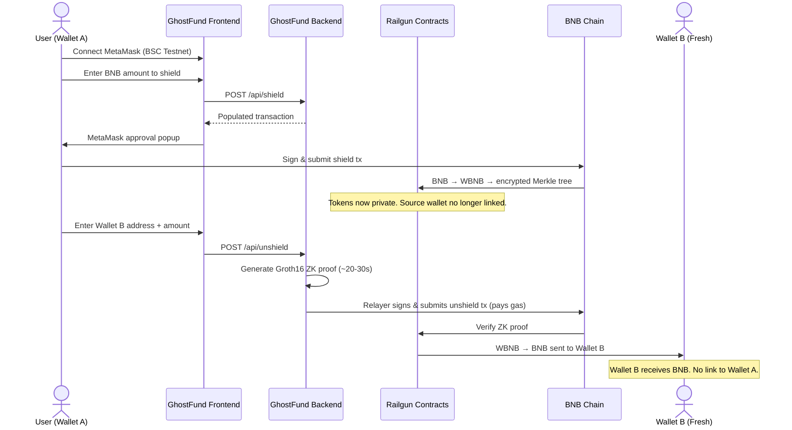
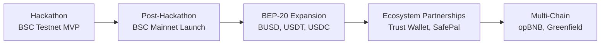

# GhostFund — Project Documentation

## Problem Statement

When a user creates a fresh crypto wallet and funds it from a KYC'd exchange (Binance, Coinbase, etc.), the on-chain transaction creates a **permanent, public link**:

```
Binance Hot Wallet  →  0xFreshWallet     (visible on BscScan, forever)
```

Anyone — employers, adversaries, data analytics firms — can trace that `0xFreshWallet` belongs to the same person who verified identity on Binance. This is the **single biggest privacy leak in crypto** and it happens before the user even does anything with their funds.

Existing solutions fall short:

| Approach | Why It Fails |
|----------|-------------|
| **Tornado Cash** | Fixed denominations, OFAC sanctioned, no compliance layer, Ethereum-only |
| **CEX internal transfers** | Still KYC-linked; not trustless |
| **Multiple hops** | Analytics firms (Chainalysis, Elliptic) trace multi-hop routes trivially |
| **Privacy coins (Monero, Zcash)** | Require bridging out of BNB ecosystem; exchanges delist them |

**There is no production-ready, compliant, privacy transfer tool on BNB Chain today.** GhostFund fills this gap.

---

## Solution

GhostFund is a **privacy gas relayer** built on BNB Chain that breaks the on-chain link between source and destination wallets. It leverages [Railgun](https://railgun.org)'s UTXO-based zero-knowledge privacy system — the same battle-tested technology deployed on Ethereum, Polygon, and Arbitrum — and brings it to BSC for the first time with a gas relayer UX layer.

### How It Works



### What the Blockchain Sees

```
TX 1:  0xSource       →  RailgunProxy     (shield — one of many deposits)
TX 2:  GhostRelayer   →  RailgunProxy     (unshield to 0xDest — relayer pays gas)

Result: No transaction between 0xSource and 0xDest. The link is broken.
```

---

## What Makes GhostFund Different

| Feature | Tornado Cash | GhostFund (Railgun-based) |
|---------|-------------|--------------------------|
| **Amount flexibility** | Fixed denominations (0.1, 1, 10 ETH) | Any BNB amount — UTXO-based |
| **Compliance** | None (OFAC sanctioned) | PPOI (Private Proof of Innocence) built-in |
| **Token support** | One pool per token per denomination | BNB (default) + any BEP-20 token |
| **DeFi composability** | None | Cross-contract calls while private (Cookbook) |
| **Gas for recipient** | User's problem | GhostFund relayer pays gas — destination needs $0 |
| **Target chain** | Ethereum only | BSC-native (BNB Chain first) |
| **Architecture** | The pool IS the product | Pool is infrastructure; relayer + UX is the product |

---

## Innovation & Technical Novelty

1. **First Railgun gas relayer on BNB Chain.** Railgun contracts exist on BSC mainnet but have no relayer infrastructure. GhostFund is the first application that wraps them with a usable relayer service and modern frontend.

2. **Runtime SDK patching for custom deployments.** The Railgun SDK has no `BSC Testnet` network entry. Instead of maintaining a permanent fork, GhostFund patches the `NetworkName.Hardhat` config at runtime — overriding chain ID, contract addresses, and gas type — so the unmodified `@railgun-community/wallet` SDK works against our custom-deployed BSC testnet contracts.

3. **GhostPaymaster contract for trustless gas reimbursement.** A custom Solidity contract (`GhostPaymaster.sol`) pools BNB from fee deposits and reimburses the relayer on-chain, removing the need to trust a centralized operator for gas accounting.

4. **MetaMask signature → shield key derivation.** Railgun requires a 32-byte symmetric key to encrypt UTXO commitment notes. GhostFund derives this from a MetaMask `personal_sign` signature by hashing the 65-byte signature via `keccak256` — no extra key management for the user.

5. **ZK proof generation as a backend service.** Groth16 proofs are generated server-side using `snarkjs`, keeping the browser lightweight. The relayer signs and submits the proven transaction, so the destination wallet needs zero BNB balance.

---

## Target Users & Market Fit

### Primary Users

- **Privacy-conscious DeFi users** on BNB Chain who want to break the wallet-to-wallet link after withdrawing from a centralized exchange
- **High-net-worth individuals** who don't want their portfolio visible to the public after a single on-chain deposit
- **DAOs and organizations** making treasury payments that shouldn't reveal the full treasury balance

### Market Timing

- BNB Chain has **$5B+ TVL** and is the #3 EVM chain by active users
- Tornado Cash's OFAC sanctions (August 2022) created a vacuum — users need compliant privacy, not banned tools
- Railgun's PPOI compliance layer (launched 2024) solved the regulatory concern that killed previous privacy protocols
- No existing privacy relayer product serves the BNB Chain ecosystem

---

## Business & Token Model

### Revenue Structure

| Revenue Stream | Mechanism | Token |
|---------------|-----------|-------|
| **Relayer fee** | 0.3% of each unshielded BNB amount | BNB (deducted as WBNB) |
| **Gas spread** | Relayer pays ~0.003 BNB gas, recoups from fee margin | BNB |
| **Paymaster premium** (Phase 2) | Accept BEP-20 fee payment at slight markup | BUSD/USDT → BNB |
| **Volume tiers** (future) | Lower % for high-volume users | BNB |

### Fee Breakdown (per transaction)

```
SHIELD (user signs via MetaMask):
  Railgun protocol fee:  0.25%

UNSHIELD (relayer submits):
  Railgun protocol fee:  0.25%
  GhostFund relayer fee: 0.30%
  BSC gas:               ~0.003 BNB (paid by relayer)

  Total cost to user:    ~0.8%
```

For a 1 BNB transfer, the user receives ~0.992 BNB at the destination. Competitive with centralized alternatives and significantly cheaper than Ethereum L1 privacy solutions.

---

## Adoption & Growth Plan



| Phase | Timeline | Milestone |
|-------|----------|-----------|
| **Hackathon** | Now | BSC Testnet deployment, end-to-end shield → unshield demo |
| **Post-Hackathon** | Q2 2026 | BSC Mainnet deployment using existing Railgun contracts (`0x590162bf...`) |
| **BEP-20 Support** | Q3 2026 | Add BUSD, USDT, USDC shield/unshield support |
| **Wallet Integration** | Q3 2026 | Partner with Trust Wallet and SafePal to embed GhostFund as a privacy layer |
| **opBNB Expansion** | Q4 2026 | Deploy on opBNB L2 for sub-cent privacy transfers |
| **Greenfield Integration** | Q4 2026 | Private file storage payments via Greenfield + GhostFund |

### Ecosystem Value for BNB Chain

GhostFund strengthens the BNB Chain ecosystem by:

1. **Filling a gap** — no production privacy relayer exists on BSC today
2. **Driving TVL** — shielded BNB locked in the Railgun pool adds to BSC's DeFi TVL
3. **Enabling composability** — Railgun's Cookbook allows private interactions with PancakeSwap, Venus, and other BSC protocols
4. **Attracting privacy-focused users** to BNB Chain from Ethereum and Polygon where Railgun already operates
5. **Demonstrating BNB Chain's technical capability** to support advanced ZK cryptography (Groth16 verification on-chain)

---

## Limitations & Risks (Honest Assessment)

| Risk | Impact | Mitigation |
|------|--------|------------|
| Small anonymity set on testnet | Privacy is weaker with few users | Pre-seed the pool; mainnet launch inherits Railgun's existing anonymity set |
| ZK proof generation is slow (~30s) | UX friction during unshield | Show progress bar; future: GPU-accelerated provers, WASM prover in-browser |
| Relayer is centralized (Phase 1) | Single point of failure | GhostPaymaster contract enables trustless gas reimbursement (Phase 2) |
| Regulatory uncertainty | Privacy tools face scrutiny | PPOI compliance layer built-in; designed for legal privacy, not evasion |
| SDK compatibility | Railgun SDK updates may break patches | Runtime patching is isolated to one config file; easy to update |

---

## Open Source Dependencies

GhostFund is built on the shoulders of these open-source projects:

### Core Infrastructure
| Dependency | Version | License | Role |
|-----------|---------|---------|------|
| [@railgun-community/wallet](https://github.com/Railgun-Community/wallet) | 10.4.0 | MIT | Privacy engine, ZK proofs, UTXO management |
| [@railgun-community/shared-models](https://github.com/Railgun-Community/shared-models) | 7.6.1 | MIT | Network configs, type definitions |
| [Railgun Contracts](https://github.com/Railgun-Privacy/contract) | — | UNLICENSED | On-chain privacy contracts (deployed to BSC) |
| [snarkjs](https://github.com/iden3/snarkjs) | 0.7.3 | GPL-3.0 | Groth16 ZK prover |

### Backend
| Dependency | Version | License | Role |
|-----------|---------|---------|------|
| [Express](https://expressjs.com/) | 4.18.2 | MIT | REST API server |
| [ethers.js](https://docs.ethers.org/v6/) | 6.13.1 | MIT | Blockchain interaction, tx signing |
| [LevelDB (leveldown)](https://github.com/Level/leveldown) | 6.1.1 | MIT | Internal Railgun SDK storage |

### Frontend
| Dependency | Version | License | Role |
|-----------|---------|---------|------|
| [Next.js](https://nextjs.org/) | 14.1.0 | MIT | React framework, SSR |
| [wagmi](https://wagmi.sh/) | 2.5.0 | MIT | Wallet connection (MetaMask, Trust) |
| [viem](https://viem.sh/) | 2.7.0 | MIT | Low-level EVM interaction |
| [TailwindCSS](https://tailwindcss.com/) | 3.x | MIT | Utility-first CSS |

### Smart Contracts
| Dependency | Version | License | Role |
|-----------|---------|---------|------|
| [OpenZeppelin Contracts](https://openzeppelin.com/contracts) | 5.0.0 | MIT | Ownable, ReentrancyGuard, SafeERC20 |
| [Hardhat](https://hardhat.org/) | 2.19.0 | MIT | Contract compilation & deployment |
