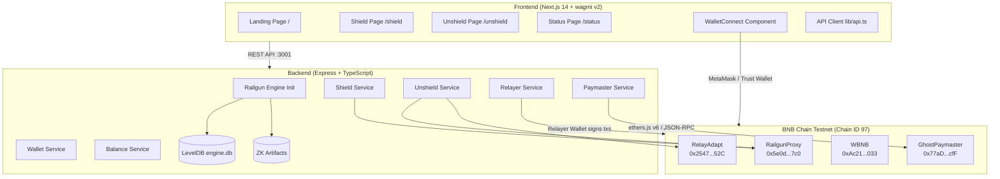
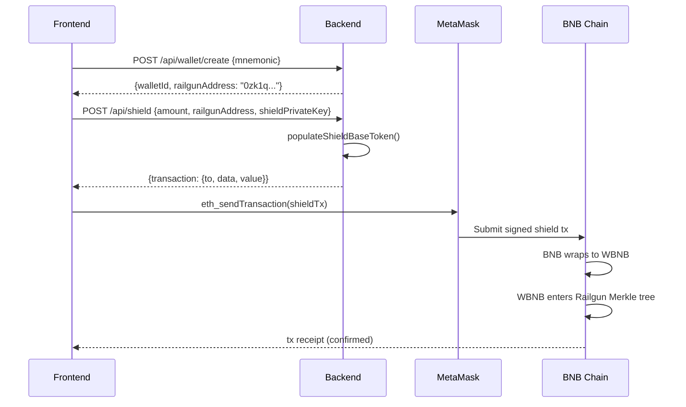
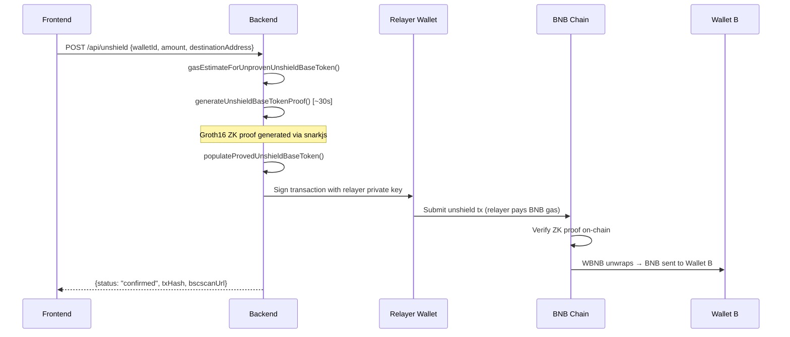

# GhostFund — Technical Documentation

## System Architecture



---

## User Journey Flow

```mermaid
flowchart TD
    START([User visits GhostFund]) --> CONNECT[Connect MetaMask on BSC Testnet]
    CONNECT --> SHIELD_PAGE[Navigate to /shield]

    subgraph SHIELD["Phase 1: Shield BNB (User Signs)"]
        SHIELD_PAGE --> INIT_WALLET[Initialize 0zk Wallet<br/>POST /api/wallet/create]
        INIT_WALLET --> SIGN_KEY[Sign message in MetaMask<br/>to derive shield private key]
        SIGN_KEY --> ENTER_AMT[Enter BNB amount]
        ENTER_AMT --> POP_TX[Backend populates shield tx<br/>POST /api/shield]
        POP_TX --> MM_SIGN[MetaMask signs on-chain tx]
        MM_SIGN --> BSC_CONFIRM[BSC confirms shield tx<br/>BNB → WBNB → Railgun Merkle tree]
    end

    BSC_CONFIRM --> STATUS_PAGE[Check /status page<br/>View private balance]
    STATUS_PAGE --> UNSHIELD_PAGE[Navigate to /unshield]

    subgraph UNSHIELD["Phase 2: Unshield BNB (Relayer Signs)"]
        UNSHIELD_PAGE --> ENTER_DEST[Enter destination Wallet B address]
        ENTER_DEST --> ENTER_AMT2[Enter amount to unshield]
        ENTER_AMT2 --> SUBMIT[Submit unshield request<br/>POST /api/unshield]
        SUBMIT --> ZK_PROOF[Backend generates Groth16 ZK proof<br/>~20-30 seconds]
        ZK_PROOF --> RELAYER_TX[Relayer signs & submits tx<br/>pays gas from its own BNB]
        RELAYER_TX --> BSC_CONFIRM2[BSC verifies proof & sends<br/>WBNB → BNB to Wallet B]
    end

    BSC_CONFIRM2 --> RESULT([Wallet B has BNB<br/>No link to Wallet A on-chain])

    style SHIELD fill:#1a1a2e,stroke:#00ff88
    style UNSHIELD fill:#1a1a2e,stroke:#00ff88
    style RESULT fill:#0d2f1b,stroke:#00ff88
```



---

## Data Flow Details

### Shield Flow (User Signs via MetaMask)



### Unshield Flow (Relayer Signs + Pays Gas)



---

## Repository Structure

```
bnb_ghostfund/
├── README.md                    # Project overview (you're reading it)
├── LICENSE                      # MIT License
├── bsc.address                  # All deployed contract addresses + explorer links
├── docker-compose.yml           # One-command launch: backend + frontend
├── .env.example                 # Environment variable template
│
├── docs/
│   ├── PROJECT.md               # Problem, solution, market, roadmap
│   └── TECHNICAL.md             # Architecture, diagrams, setup (this file)
│
├── backend/
│   ├── Dockerfile               # Node 18 Alpine, multi-stage build
│   ├── .env.example             # Backend env template
│   ├── package.json
│   ├── tsconfig.json
│   └── src/
│       ├── index.ts             # Express server + engine init
│       ├── config/
│       │   ├── constants.ts     # Env vars, network config, fee settings
│       │   ├── database.ts      # LevelDB for Railgun Engine
│       │   ├── artifacts.ts     # ZK circuit artifact storage
│       │   └── engine.ts        # Railgun Engine init + BSC testnet patching
│       ├── services/
│       │   ├── wallet.service.ts    # 0zk wallet creation/loading
│       │   ├── shield.service.ts    # Shield tx population for MetaMask
│       │   ├── unshield.service.ts  # ZK proof → relayer signs → submits
│       │   ├── balance.service.ts   # Private balance queries (Merkle tree)
│       │   ├── relayer.service.ts   # Relayer wallet, gas, provider
│       │   └── paymaster.service.ts # GhostPaymaster contract interaction
│       ├── routes/
│       │   ├── wallet.routes.ts
│       │   ├── shield.routes.ts
│       │   ├── unshield.routes.ts
│       │   ├── status.routes.ts
│       │   └── paymaster.routes.ts
│       └── utils/
│           └── gas.ts           # BSC gas estimation helpers
│
├── frontend/
│   ├── Dockerfile               # Node 18 Alpine, Next.js build
│   ├── package.json
│   ├── next.config.js
│   ├── tailwind.config.ts
│   ├── app/
│   │   ├── layout.tsx           # Root layout + global providers
│   │   ├── page.tsx             # Landing page (problem + solution explainer)
│   │   ├── providers.tsx        # wagmi + React Query providers
│   │   ├── globals.css          # TailwindCSS + custom theme
│   │   ├── shield/page.tsx      # Shield BNB flow
│   │   ├── status/page.tsx      # View private balance
│   │   └── unshield/page.tsx    # Unshield BNB to destination
│   ├── components/
│   │   ├── Navbar.tsx
│   │   ├── ShieldForm.tsx
│   │   ├── UnshieldForm.tsx
│   │   ├── TxStatus.tsx
│   │   └── WalletConnect.tsx
│   └── lib/
│       ├── api.ts               # Backend API client
│       └── wagmi.ts             # wagmi config (BSC Testnet, injected connector)
│
├── contracts/
│   ├── ghostfund/               # Our custom contracts
│   │   ├── contracts/
│   │   │   └── GhostPaymaster.sol   # Fee pool + gas reimbursement
│   │   ├── scripts/
│   │   │   └── deploy.ts
│   │   └── hardhat.config.ts
│   └── railgun/                 # Cloned from railgun-privacy/contract
│       ├── contracts/           # Full Railgun contract suite (proxy, logic, verifiers)
│       ├── scripts/
│       │   ├── deploy-final.ts
│       │   └── continue-deploy.ts
│       └── hardhat.config.ts
│
├── packages/
│   └── shared-models/           # SDK patch documentation
│
└── memory-bank/                 # Internal development docs (PRD, TDD)
    ├── architecture.md
    ├── prd.md
    ├── tdd.md
    └── running-and-testing.md
```

---

## Quick Start

### Prerequisites

- **Node.js 18+** (LTS recommended)
- **MetaMask** browser extension
- **tBNB** from the [BSC Testnet Faucet](https://www.bnbchain.org/en/testnet-faucet)

### Option 1: Docker (Recommended)

```bash
# Clone the repository
git clone https://github.com/priyanshu-dangi/ghostfund.git
cd ghostfund

# Configure environment
cp .env.example backend/.env
# Edit backend/.env with your RELAYER_PRIVATE_KEY (funded with tBNB)

# Launch everything
docker-compose up --build
```

Backend runs on `http://localhost:3001`, frontend on `http://localhost:3000`.

### Option 2: Manual Setup

```bash
# Install backend dependencies
cd backend && npm install

# Configure environment
cp .env.example .env
# Edit .env with your values (see Environment Variables below)

# Start backend (first run downloads ~50-100MB of ZK artifacts)
npm run dev
# Wait for: "[GhostFund] Server running on http://localhost:3001"

# In a new terminal — start frontend
cd frontend && npm install
npm run dev
# Open http://localhost:3000
```

### Environment Variables

Create `backend/.env` from `.env.example`. All deployed contract addresses are pre-configured:

```env
# BSC Testnet RPC
BSC_TESTNET_RPC=https://data-seed-prebsc-1-s1.bnbchain.org:8545

# Deployed Railgun contracts (already deployed — use these values)
RAILGUN_PROXY=0x5e0d11D4Ba0B606c4dd19eAbce2d43daFCE6b7c0
RAILGUN_RELAY_ADAPT=0x254798830B89f716E66D2F77b611320883a7A52C
RAILGUN_WBNB=0xAc21F2a5fA4297bE7E150Dd8133BcaDe04979033
DEPLOYMENT_BLOCK=92832756

# GhostPaymaster (already deployed)
GHOST_PAYMASTER=0x77aDC78a0dfE3A7622149b93977cEe68343eefcF

# Your relayer wallet (must be funded with tBNB for gas)
RELAYER_PRIVATE_KEY=0x_YOUR_PRIVATE_KEY_HERE

# Railgun wallet config
RAILGUN_MNEMONIC="test test test test test test test test test test test junk"
RAILGUN_ENCRYPTION_KEY=0101010101010101010101010101010101010101010101010101010101010101

# Engine storage
ENGINE_DB_PATH=./engine.db
ARTIFACTS_PATH=./artifacts

# PPOI (disabled for testnet)
PPOI_AGGREGATOR_URL=https://ppoi-agg.horsewithsixlegs.xyz

# Server
PORT=3001
```

### Add BSC Testnet to MetaMask

| Field        | Value                                              |
|--------------|----------------------------------------------------|
| Network Name | BSC Testnet                                        |
| RPC URL      | `https://data-seed-prebsc-1-s1.bnbchain.org:8545`  |
| Chain ID     | `97`                                               |
| Symbol       | `tBNB`                                             |
| Explorer     | `https://testnet.bscscan.com`                      |

---

## API Reference

| Method | Endpoint | Description |
|--------|----------|-------------|
| GET | `/api/health` | Service health + relayer wallet balance |
| GET | `/api/fees` | Fee breakdown (shield, unshield, relayer, total) |
| POST | `/api/wallet/create` | Create a Railgun 0zk wallet from mnemonic |
| GET | `/api/wallet/:walletId/address` | Get wallet's 0zk railgun address |
| GET | `/api/shield/signature-message` | Get message to sign for shield key derivation |
| POST | `/api/shield` | Populate shield tx for MetaMask signing |
| POST | `/api/unshield` | Generate ZK proof + relayer submits unshield tx |
| GET | `/api/status/:txHash` | Transaction status on BSC testnet |
| GET | `/api/status/balance/:walletId` | Query private (shielded) balance |
| GET | `/api/paymaster` | GhostPaymaster contract info |
| GET | `/api/paymaster/fee/:amountWei` | Calculate paymaster fee for amount |
| POST | `/api/paymaster/fund` | Fund the paymaster BNB pool |

---

## Smart Contracts

### GhostPaymaster (`contracts/ghostfund/contracts/GhostPaymaster.sol`)

Custom Solidity contract for trustless gas reimbursement:

- **Accepts BEP-20 fee deposits** from users via `depositFee(token, amount)`
- **Reimburses relayer** for BNB gas via `claimGasReimbursement(gasUsed, gasPrice)`
- **Configurable fee** via `feeBasisPoints` (default: 50 = 0.5%, max: 1000 = 10%)
- **Security**: `Ownable`, `ReentrancyGuard`, `SafeERC20`
- **Events**: `FeeDeposited`, `GasReimbursed`, `RelayerUpdated`, `FeeBasisPointsUpdated`

### Railgun Contracts (deployed from `railgun-privacy/contract`)

Full Railgun V2 contract suite deployed to BSC Testnet:

| Contract | Purpose |
|----------|---------|
| **RailgunProxy** | Main entry point (EIP-1967 upgradeable proxy) |
| **RailgunLogic** | Core shield/unshield/transfer logic |
| **RelayAdapt** | Multi-call adapter for cross-contract interactions |
| **WBNB (WETH9)** | Wrapped BNB for ERC-20 compatibility with Railgun |
| **Poseidon T3/T4** | Hash functions for Merkle tree construction |
| **Verifier** | On-chain Groth16 ZK proof verification |
| **Treasury** | Protocol fee collection |
| **Delegator** | Governance action execution |

---

## Key Technical Decisions

| Decision | Rationale |
|----------|-----------|
| **Runtime SDK patching** (NetworkName.Hardhat override) | Avoids maintaining a permanent fork of `@railgun-community/shared-models`. One file (`engine.ts`) patches chain ID, contract addresses, and gas type. |
| **V3 disabled** (`supportsV3: false`) | Only Railgun V2 contracts were deployed to BSC testnet. Prevents SDK from calling nonexistent V3 addresses. |
| **Server-side proof generation** | Groth16 proofs require ~30s on server hardware. In-browser would be slower and require WASM compilation. |
| **Blocking unshield endpoint** | Proof generation blocks the HTTP request for hackathon simplicity. Production would use a job queue. |
| **BSC Type0 gas** | BSC uses legacy gas pricing (`gasPrice`), not EIP-1559 (`maxFeePerGas`). |
| **LevelDB (engine.db)** | Not a project database — internal to Railgun SDK for Merkle tree state. Never read/written directly. |
| **Per-user mnemonics** | Generated client-side via `viem/accounts`, stored in `localStorage`. Sent to backend on first use. |
| **keccak256 signature hashing** | MetaMask signatures are 65 bytes; Railgun needs 32-byte shield keys. `keccak256(signature)` bridges the gap. |

---

## Demo Guide

### Step-by-Step Flow

1. **Open** `http://localhost:3000` — landing page explains the privacy problem
2. **Connect** MetaMask on BSC Testnet (ensure tBNB balance in Wallet A)
3. **Navigate** to `/shield`
4. **Initialize** wallet — creates a 0zk keypair
5. **Sign** shield key — MetaMask signs a message to derive encryption key
6. **Enter** BNB amount (e.g., `0.01`) and click **Shield BNB**
7. **Sign** the on-chain transaction in MetaMask
8. **Wait** for BSC confirmation (~3-5 seconds)
9. **Check** `/status` — private balance should appear after scanner syncs
10. **Navigate** to `/unshield`
11. **Enter** Wallet B address (fresh wallet, zero balance) and amount
12. **Click** Unshield — backend generates ZK proof (~20-30 seconds)
13. **Verify** on [testnet BscScan](https://testnet.bscscan.com):
    - Wallet A has a shield tx to RailgunProxy
    - Wallet B received BNB from GhostRelayer
    - **No direct transaction between Wallet A and Wallet B**

### Verifying Privacy On-Chain

```bash
# Search Wallet A transactions
# Result: Shield tx → RailgunProxy

# Search Wallet B transactions
# Result: Receive from GhostRelayer (0x117A3E...)

# Search for ANY tx between Wallet A and Wallet B
# Result: NONE. The link is broken.
```

---

## Troubleshooting

| Problem | Fix |
|---------|-----|
| `Invalid chain ID` | Both copies of `shared-models` (top-level + nested in wallet SDK) must be patched. Check `engine.ts`. |
| `Invalid fallback provider config` | Provider `weight` must be >= 2. Set `weight: 2` in provider config. |
| Balance shows 0 after shielding | Delete `engine.db/` and restart backend. Corrupt cache prevents detection. |
| Scanner stuck at 50% | Delete `engine.db/` directory. Corrupt cached scan data. |
| MetaMask wrong network | Switch to BSC Testnet (Chain ID 97). |
| Relayer out of gas | Fund the relayer wallet with more tBNB from the faucet. |
| Engine downloads slowly | ZK artifacts download from IPFS on first run (~50-100MB). Cached afterward in `artifacts/`. |
| CORS errors | Backend defaults to allowing `localhost:3000`. Check `FRONTEND_URL` env var. |
| `No RAILGUN wallet for ID` | Wallet is in-memory only. Ensure `RAILGUN_MNEMONIC` matches. Auto-reloads on startup. |
